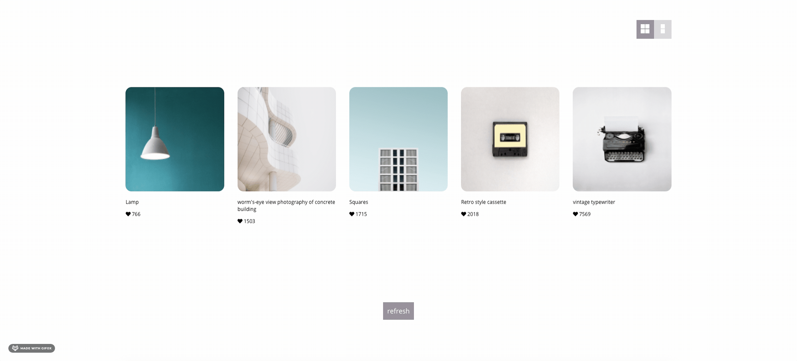

# Demo

## Run the app locally

Clone this repository and in the project directory run npm install

### `npm start`

start the app

### `npm test`

run the tests

## App content

In this project i've developed an image-grid web application, the app has the following features:

- Display different 5 images on each refresh button click.
- View mode buttons, the user can select the view mode of the gallery (vertical/horizontal)
- In addition i developed a logic to prevent image duplicates, this means new images will be different than previous time, and also among themselves.
- I chose to work with CSS modules so each class will be applied only on the relevant component.

## tests

### manual tests

- manual testing of the app features, i made sure the images are random each click and that there are no duplicates.
- verified the layout is responsive for mobile devices as well, and when shrinking the window size

### automatic tests

- Developed unit tests that test the 'no-duplications' algorithm

## What can be improved? (Next steps)

- Display an error modal when something goes wrong, instead of showing H1 info
- Add more features and tests (e.g add backend server and authentication so users will be able to save their
  favorite pictures)
- Deploy the app
- test the app components

## Tech Stack

React, react hooks, jest
